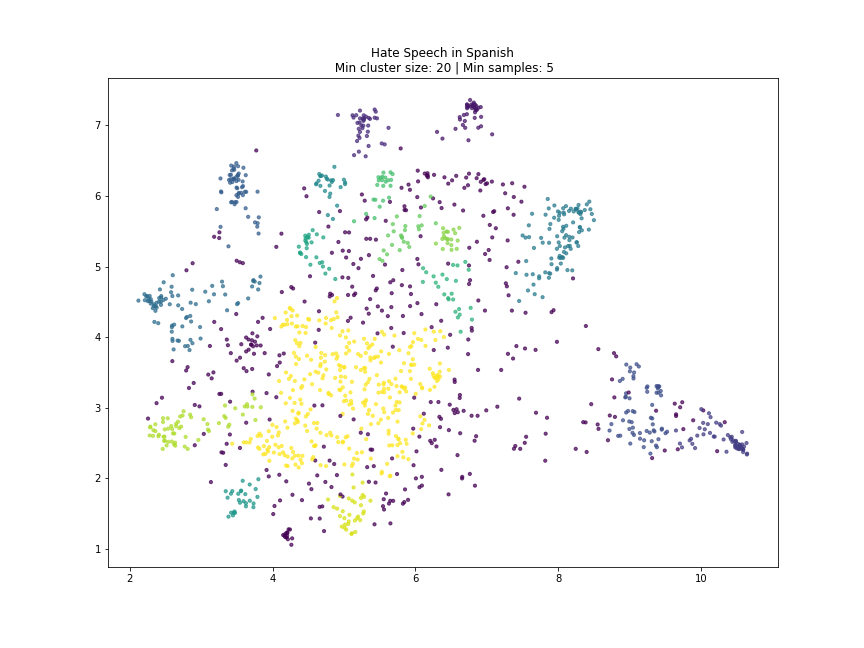
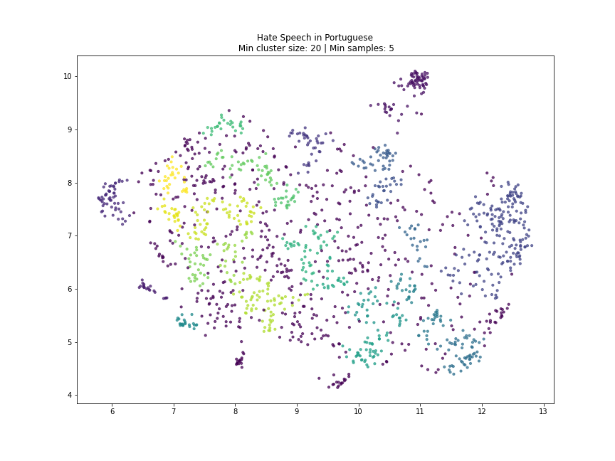

# Attack Detector

This project is part of the [2022 JournalismAI Fellowship Programme](https://www.lse.ac.uk/media-and-communications/polis/JournalismAI/Fellowship-Programme). The Fellowship brought together 46 journalists and technologists from across the world to collaboratively explore innovative solutions to improve journalism via the use of AI technologies. You can explore all the Fellowship projects [at this link](https://www.lse.ac.uk/media-and-communications/polis/JournalismAI/Fellowship-Programme).

The project was developed as a collaboration between *[Abraji](https://www.abraji.org.br/)* and *[Data Crítica](https://datacritica.org/)*. The fellows who contributed to the project are: *[Reinaldo Chaves](https://twitter.com/paidatocandeira) (Project Coordinator-Abraji), [Schirlei Alves](https://twitter.com/schirlei_alves) (Data Journalist-Abraji), [Fernanda Aguirre](https://twitter.com/feragru) (Data Analyst & Researcher-Data Crítica) and [Gibran Mena](https://twitter.com/gibsteria) (Co-founder & Director-Data Crítica)*.

[JournalismAI](https://www.lse.ac.uk/media-and-communications/polis/JournalismAI) is a project of [Polis](https://www.lse.ac.uk/media-and-communications/polis) – the journalism think-tank at the London School of Economics and Political Science – and it’s sponsored by the [Google News Initiative](https://newsinitiative.withgoogle.com/). If you want to know more about the Fellowship and the other JournalismAI activities, [sign up for the newsletter](https://mailchi.mp/lse.ac.uk/journalismai) or get in touch with the team via hello@journalismai.info

---

## Contents

- [Introduction](#introduction)
- [Methodology](#methodology)
- [Data](#data)
- [Labelling](#labelling)
- [Pre-trained models](#pre-trained-models)
- [Topic modeling](#topic-modeling)
- [Future work](#future-work)
- [Contact us](#contact-us)

---

## Introduction

The motivation for this project is the rampant situation of violence against journalists in our countries. Between January and April 2022, Abraji identified 151 episodes of physical and verbal aggressions against journalists in Brazil (62.9% originated on the internet).

In Mexico, from 2000 to date, the journalist protection organization [Artículo 19](https://articulo19.org/) has documented 156 murders of journalists. 47 happened during the administration of former President Enrique Peña Nieto and 36 under current President Andrés Manuel López Obrador. 

In the 2021 [World Press Freedom Index](https://rsf.org/en/2021-world-press-freedom-index-journalism-vaccine-against-disinformation-blocked-more-130-countries), Reporters Without Borders places Brazil and Mexico on the list of countries where journalism is very risky – 111th and 143rd respectively – out of 180 countries. They share the “bad” classification with India (142nd) and Russia (at 150th), among others.

Digital violence is known to have serious consequences for the psychological health of journalists and land defender activists. The defender Samir Flores Soberanes was murdered in Mexico after being vilified by the Mexican government for his opposition to the Morelos Integral Project. The defender Bruno Pereira was also recently murdered along with journalist Dom Phillips in an investigation in the Yavari Valley in Brazil.

It is essential to analyse online attacks to understand how they work, who initiates them, who shares these messages, and what forms the attacks take. For example, it is important to understand whether they are misogynistic, racist, or a combination of various forms of hate speech.

---

## Methodology

---

## Data

---

## Labelling

---

## Pre-trained models

---

## Topic modeling

To classify the different types of hate speech, we applied the [HDBSCAN](https://hdbscan.readthedocs.io/en/latest/) algorithm to identify clusters.

### Clusters for hate speech data in Spanish 

### Clusters for hate speech data in Portuguese 

So far we have identified that the clusters are grouped according to the types of insults used, i.e., attacks based on fatphobia, transphobia, offenses to physical appearance, offenses questioning the intellect, just to mention a few.

---

## Future work

---

## Contact us

If you want to collaborate or just to know more about the project, please reach out to us:

- reinaldo@abraji.org.br
- faguirre@datacritica.org